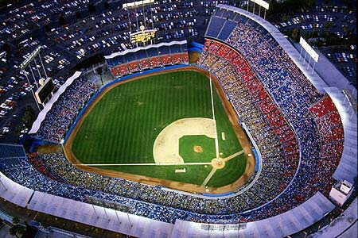

# Data Analysis to increase Dodgers Stadium Attendance.

## Introduction

The Dodgers is a professional baseball team and plays in the Major Baseball League. The team owns a 56,000-seat stadium and is interested in increasing the attendance of their fans during home games.*At the moment the team management would like to know if bobblehead promotions increase the attendance of the team’s fans* ?





Factors affecting the attendance

#### Natural factors
* Climate.
* Days of Week.

#### Human factors
* Distributing Bobbleheads.
* Distributing Shirts and Caps.
* Fireworks.
* Rivalry Matches (Popular Opponents)

## How its done ?

This project is a mix of exploratory data analysis and Statistics.
Simple Exploratory Data Analysis is used where graphs such as:

* Box and Whisker Plots
* Line Graphs

are used and Statistical tests such as

* Chi Squared test
* Linear Regression
* F-tests

are performed.


## Demo

Please check hosted R Markdown file, it has a dedicated contents page to guide you and all the details you will need along with code examples.

* https://hatimz.github.io/data-analysis/


## Run Locally

You need R-Studio to edit the and run the code. Install the editor
and do the following steps:

Clone the project

```bash
  git clone https://github.com/HatimZ/data-analysis.git
```

Go to the project directory

```bash
  cd data-analysis
```

Install dependencies

Install it from the dedicated CLI inside R-Studio and Run the project.

After you are done, knit the file to html type or you can also make a 
pdf.


## Badges

Add badges from somewhere like: [shields.io](https://shields.io/)

[](https://choosealicense.com/licenses/mit/)
[](https://opensource.org/licenses/)
[](http://www.gnu.org/licenses/agpl-3.0)


## 🛠 Skills
R, Statistics, R-Studio 


